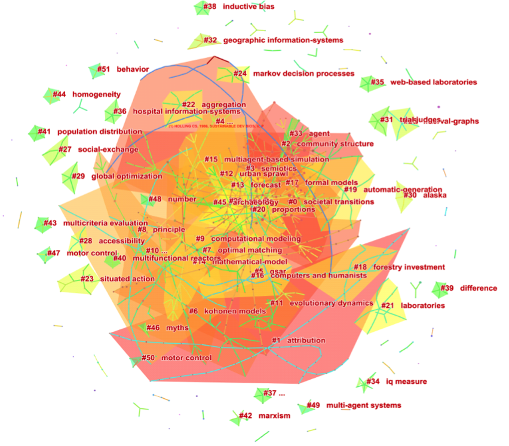
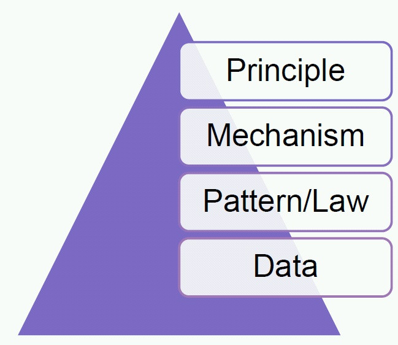

#第一章 计算传播学简介

##内容简介

* 一、引言：大数据时代
* 二、如何认识世界
* 三、科学的四重境界
* 四、可计算性
* 五、定义计算传播
* 六、通往计算传播学之路
    - 方法
    - 工具
    - 案例

##一、引言：计算社会科学时代的到来

计算传播学（computational communication research）是计算社会科学（computational social science）的重要分支。目前，计算社会科学已经在各个分支学科和新的交叉性学科中如火如荼。Lazer等人2009年在《科学》杂志上发表了题为《计算社会科学》（ Compuational social science）的文章,在这篇论文当中，**计算社会科学**的概念被正式提出[^1]。Lazer等人强调了大规模的数据收集和数据分析以及网络科学视角对于计算社会科学扮演者至关重要的作用，提出计算社会科学研究可以帮助研究者揭示个体和群体行为的模式。其实早在2007年，网络科学的重要研究者D. Watts就已经在《自然》杂志上发表了题为《一个二十一世纪的科学》的论文[^2]。Watts认为社会科学将成为在二十一世纪获得重要发展的研究领域，其主要原因来源于互联网大数据的使用和网络科学视角。计算社会科学的兴起都使得我们开始更加严肃地思考可计算性在传播学研究当中的作用。

除了计算社会科学的构建成为科学发展的重要议程之外，一些与之相关概念开始进入学术界和社会公众的视野，诸如计算语言学 （computational linguistics）、数据科学（data science）、社会计算 （social computing）、普适计算（ubiquitous computing）、大数据（big data）、可视化 （visualization）、数据新闻学 (data journalism)、计算广告学 (computational advising)，如何从可计算化的角度认识和理解这些概念也传播学研究者的当务之急。基于此提出本文主要的研究问题：如何理解计算社会科学与传播学的关系？

为了系统地梳理关于计算社会科学的相关文献，可采用“computational social science”作为关键词在web of science的数据库中检索，总共发现321篇相关文献。从2009年之后，关于计算社会科学的研究不断增多，其引用数量也相应增长。为了展现相关研究的主要引用文献，本文分析了计算社会科学文献的引文网络（如图1所示）。由引用网络可以观察到，该网络具有一个链接紧密的组元（component），计算社会科学研究已经成为一个相对统一的研究领域。

图 1 计算社会科学文献的引文网络

从被引用的期刊而言，前十名的期刊主要来自综合类的期刊（如《科学》、《自然》等期刊）、社会学、计算机科学、心理学和物理学等学科，值得注意的是这些期刊是整个科学领域最重要的期刊，因此展现了计算社会科学的跨学科特点和吸引力（见表格1）。

表格 1  被引用数量前十名的期刊

| 引用数量 | 期刊 | 类别|
| -- | -- | -- |
|120|	SCIENCE, 1997, SCIENCE, V, P	|综合|
|100|	NATURE, 1998, NATURE, V, P	|综合|
|89|P NATL ACAD SCI USA, 2002, P NATL ACAD SCI USA, V, P	|综合|
|46|	Am J SOCIOL, 1981, AM J SOCIOL, V, P	|社会学|
|35|	Lect NOTES COMPUT SC, 1995, LECT NOTES COMPUT SC, V, P	|计算机|
|34|	Psychol REV, 1956, PSYCHOL REV, V, P	|心理学|
|34|	J MATH SOCIOL, 1994, J MATH SOCIOL, V, P	|社会学|
|33|	Phys REV E, 1999, PHYS REV E, V, P	|物理学|
|32|	Commun ACM, 1995, COMMUN ACM, V, P	|计算机|
|29|	Soc NETWORKS, 1986, SOC NETWORKS, V, P	|社会学|

根据对引文网络进行分析，我们可以得到引用数量前十名的文献（见表格2）。值得注意的是这些文献分别来自于来个方面：网络科学和多主体建模。其中，又以多主体建模的研究历史最悠久，可以追溯到Schelling在1971年发表在数学社会学期刊上的关于多主体模型的论文(Schelling, 1971)。多主体建模是一种计算机模拟（或仿真）的方法。通过计算机构建社会系统和在其中互动的主体（agent），并为主体间的互动指定简单的规则。多个主体之间通过互动而“自下而上的”演化出特定的行为模式。通过引文网络分析，我们可以发现Epstein(1996)、Axelrod(1997)、Gilbert (2008; 2005)被较广泛地引用。

表格 2 被引用数量前十名的文献

|引用数量|	文献	|类别|
| -- | -- | -- |
|26|	Lazer D, 2009, SCIENCE, V323, P721	|网络科学|
|22|	Axelrod R, 1997, COMPLEXITY COOPERATI, V, P	|多主体建模|
|17|	Wasserman S, 1994, SOCIAL NETWORK ANAL, V, P	|网络科学|
|15|	Epstein JM, 1996, GROWING ARTIFICIAL S, V, P	|多主体建模|
|12|	Schelling TC, 1971, J MATH SOCIOL, V1, P143	|多主体建模|
|10|	Watts DJ, 1998, NATURE, V393, P440	|网络科学|
|10|	Gilbert N, 2008, AGENT BASED MODELS, V, P1	|多主体建模|
|10|	Gilbert N, 2005, SIMULATION SOCIAL SC, V, P	|多主体建模|
|9|	Barabasi AL, 1999, SCIENCE, V286, P509	|网络科学|
|9|	Albert R, 2002, REV MOD PHYS, V74, P47	|网络科学|

虽然多主体建模发展的历史相对较长，真正促使计算社会科学迅速发展的动力却主要来自于网络科学的发展。Lazer等在2009年发表在《科学》杂志上的一文被引用了26次位列第一名(Lazer, Pentland, Adamic, & Aral, 2009)。Lazer等人正式地提出了计算社会科学的概念，综述了可计算性社会科学的涌现和发展，尤其强调了网络科学研究在其中所扮演的角色和数字化媒体所提供的机遇。Lazer等人(2009)认为一方面,毫不夸张地说，人类的生活已经不可避免地大范围的网络化：网络购物，网络购票，网络交友，网络表达，网络新闻，网络游戏，网络电影，网络音乐等，不一而足。

网络科学已经走出狭隘的传统的社会网研究（social network study）的藩篱，更主要是互联网浪潮的袭来，社会网络开始拥抱互联网科学（web science)，以复杂网络（complex network）为代表的新型网络科学开始迅速成长（参见《链接：网络新科学》一书(Barabasi,2002)）。1998年Watts和Strogatz在《自然》杂志上发表了关于小世界网络的研究结果，表明规则网经过简单的随机重连就可以构造出小世界网络(Watts & Strogatz, 1998)。1999年Barabási和Albert在《科学》杂志撰文指出复杂网络（如演员网络、互联网、电力网络）中的节点度分布为幂律分布，具有典型的无标度现象(Barabási & Albert, 1999)。这两个研究开启了网络科学在过去十几年里的迅速发展。

另一个推动计算社会科学发展的主要动力来自于互联网大数据(Lazer, et al., 2009)。数字化媒体,尤其是互联网的发展,大规模地记录了人类的各种传播行为。这些人类行为的“数字化指纹”（digital fingerprint）使得研究者可以非介入式地“观察”传播过程，得到更为确实可信的研究结果(Golder & Macy, 2014)。虽然互联网等可以大规模追踪人类行为的数字化媒体诞生已久，但是直到最近随着人类计算能力的提高，这些沉睡的资源才重新认识。持类似观点的人还有Watts,事实上Watts在2007年就在《自然》杂志上撰文认为社会科学将会成为二十一世纪最有潜力的学科，而促使其发展的主要动力除了网络科学的研究视角还有互联网大数据(Watts, 2007)。虽然很少有人会认为社会科学会成为21世纪科学的中心，但Watts坚持认为“如果处理得当，人类基于互联网进行的传播和互动的数据将会革命化的改变我们对于人类群体行为的理解”。更具体而言，Watts指出人类行为在网站上的记录（Website Logs）与基于互联网的实验（Web-based experiments）应该成为研究的重点。

##二、如何认识世界？
洞穴之喻&开放思维

康德：“我们所有的知识起源于感知，然后发展为理解，终结为理性。没有比理性更高的东西。”
Immanuel Kant: All our knowledge begins with the senses, proceeds then to the understanding, and ends with reason. There is nothing higher than reason.

- 理论的三个比喻
- 理论即逻辑的组合。
- 理论的沙漏模型
    - 学术论文的结构
    - 以小见大
    - 问题驱动
    - 理论驱动
    - 兴趣驱动
    - 研究设计
    - 关于世界的科学

##三、科学的四重境界

科学的金字塔
- 数据
- 模式、定律
- 机制
- 原则

数据（data）、模式（pattern）、法则（law）、机制（mechanism）和隐含的原理(principle)构成了科学研究等级，如图3所示。其中，理论的等级在这里又被粗略地划分为模式/法则、机制和原理。以网络科学的研究为例，基于各种网络的数据，Barabási等人的研究揭示了复杂网络在结构上的模式或法则，即网络度分布的无标度特征（或“幂律”）(Barabási & Albert, 1999)。Barabási等人进一步解释了构成幂律分布的机制：网络增长和优先链接。首先，网络是不断增长的，因而不停地有新的节点加入进来；其次，新节点加入进来的时候，倾向于与那些较为核心的节点优先建立连接(Barabási & Albert, 1999)。应当注意的是，目前网络科学的发展仍然停留在对于机制探索的高度，探索机制背后的普适性原理将成为计算社会科学未来发展的方向。

图3 科学研究的金字塔

科学的第一个层次来源于数据。古人根据太阳和星辰东升西落的现象，直觉地认为地球是宇宙的中心。例如，托勒密(90-168)就认为地球处于宇宙中心，星辰围绕地球做圆周运动，也就是**“地心说”**。其实，亚里斯多德（384-322B.C.）也是地心说的拥护者。亚里士多德认为天上的运动与地上的运动不同。天上行星做圆周运动，地上物体直线运动，并且只有在施加外力的时候，物体才运动。亚里斯多德进一步指出石头落地，因为它是土构成的；烟升起，因为它是气构成的。虽然亚里斯多德提出了三段论的科学思维方式，但是常识和直观观察依然主导了其逻辑思维的过程。因为“地心说”与地球上人的**直观观察**相互符合，因而主导了一千多年来人类关于天体运动的认识。

后来，随着天文观测的数据越来越多，天文观测的精确度渐渐提高，托勒密的地心说模型不得不进行不断的修正，于是变得非常复杂。人们逐渐发现了地心学说的破绽。到文艺复兴运动时期，人们发现托勒密所提出的均轮和本轮的数目竟多达八十个左右，这显然是不合理、不科学的。在这种历史背景下，地心说模型与观测数据之间的矛盾激发了新的模型的提出，日心说应运而生了。波兰人哥白尼（1473-1543）顺势提出了“日心说”，向“地心说”发起挑战。如同地心说的模型一样，哥白尼的模型同样需要经过数据的检验。由于时代的局限，哥白尼只是把宇宙的中心从地球移到了太阳，并没有放弃宇宙中心论和宇宙有限论。第谷是一个真正仰望星空的科学家。他观测星空，收集了大量的天体运行的数据。然而，哥白尼的日心说的模型与第谷收集的数据之间存在8'的误差。这表明了哥白尼的模型同样存在缺陷，并进一步后来天文学的发展。

德国人开普勒（1571-1630）放弃了神学在奥地利的一所大学教授自然科学。1600年，开普勒给素不相识的丹麦天文学家第谷写信。他把自己研究天文学的成果和想法告诉了第谷。第谷看后，对开普勒的才华惊叹不已，立即写信邀请他来当自己的助手。但是开普勒来到第谷的身边仅10个月，第谷便去世了。开普勒继承了第谷留下的非常宝贵的天文数据，其中包括对火星运动的观测资料。开普勒系统地分析了第谷所收集的天文数据。基于这些数据，开普勒定量地描述了行星运行的规律，于1609～1619年先后归纳提出行星运动三大定律，也就是开普勒定律。

- **开普勒第一定律**，也称椭圆定律或轨道定律：每一个行星都沿各自的椭圆轨道环绕太阳，而太阳则处在椭圆的一个焦点中。
- **开普勒第二定律**，也称面积定律：在相等时间内，太阳和运动中的行星的连线（向量半径）所扫过的面积都是相等的。这一定律实际揭示了行星绕太阳公转的角动量守恒。
- **开普勒第三定律**，也称调和定律，也称周期定律：是指绕以太阳为焦点的椭圆轨道运行的所有行星，其椭圆轨道半长轴的立方与周期的平方之比是一个常量。$$a^3/T^2=K$$，这里$$a$$是行星公转轨道半长轴，T是行星公转周期，K是常数，其大小只与中心天体的质量M有关。

开普勒三大定律彻底改变了整个天文学，彻底摧毁了托勒密复杂的宇宙体系，完善并简化了哥白尼的日心说。但是，开普勒三大定律是唯象的，它无法解释运动的机制。

意大利人伽利略（1554-1642）是科学实验与实证科学的开创者。伽利略从实验中总结出**自由落体定律**、**惯性定律**和**伽利略相对性原理**等。从而推翻了亚里士多德物理学的许多臆断，奠定了经典力学的基础，反驳了托勒密的地心体系，有力地支持了哥白尼的日心学说。他以系统的实验和观察推翻了纯属思辨传统的自然观，开创了以实验事实为根据并具有严密逻辑体系的近代科学。因此被誉为“近代力学之父”、“现代科学之父”。伽利略研究过单摆的运动，他发现了两个质量不同的铁球会同时落地。根据对斜面运动，伽利略构造了一个思想实验，他发现小球从斜面滑下来的时候，斜面的斜率越大，小球运动的距离越远。据此，他指出地面的摩擦力阻碍了小球的运动。通过对数据进行测量，伽利略大胆地提出如果没有外力，一个运动的物体会以一个恒定的速度不断运动下去。当然了，伽利略当然也是有局限性的，比如他不承认行星运动的轨道是椭圆形。

伽利略死后一年，牛顿降生了。年轻的牛顿提出了**运动三大定律**：一、持续运动定律：无外力时，物体保持持续匀速运动；二、惯性质量定律：外力引起物体运动的改变反比于它的质量；三、相互作用力定律：当一个物体向另一个物体施加一个力的时候，另一个物体也受到来自第一个物体的力，这两个作用力大小相等方向相反。牛顿指出持续运动定律也适用于天体运动，因而维持椭圆运动需要持续施加外力，而这个外力正是**万有引力**。1687 年，牛顿出版了力学经典著作《自然哲学的数学原理》，建立起了完整的力学理论体系，实现了物理学史上的第一次大飞跃。牛顿的伟大之处就是把天上的运动和地上的运动统一起来，找到了背后共同的机制，即万有引力，任意两个质点有通过连心线方向上的力相互吸引。该引力的大小与它们的质量乘积成正比，与它们距离的平方成反比，与两物体的化学本质或物理状态以及中介物质无关。万有引力理论，再结合牛顿的运动学定律，可以推导出可以推导出开普勒的行星运动三大定律，而且可以推导出开普勒唯象定律所不能包括的一些可能解，比如行星轨道可以呈抛物线运动或双曲线运动。

牛顿的理论并不能完全地解释出水星在沿其轨道运动到近日点时出现的进动现象进动。牛顿学说的预言（由其它行星的重力拖曳产生）与实际观察到的进动相比每世纪会出现 43弧秒的误差。牛顿的理论预言的重力作用下光线的偏折只有实际观测结果的一半。所有物体的重力质量与惯性质量相同的这一观测现象是牛顿的系统所不能解释的。

**伽利略相对性原理**
物理定律在一切惯性参考系中具有相同的形式，任何力学实验都不能区分静止和匀速运动的惯性参考系，这就是伽利略相对性原理。该原理最早由伽利略提出，是经典力学的基本原理。

爱因斯坦大幅度扩展了伽利略的相对性原理。狭义相对论指出，物理定律在任何惯性参考系中具有相同的形式，这就是狭义相对性原理。爱因斯坦把伽利略相对性原理从力学领域推广到包括电磁学在内整个物理学领域，指出任何力学和电磁学实验现象都不能区分惯性参考系的绝对运动，包括静止或者匀速运动。但是狭义相对论依然有局限性，例如牛顿引力理论却不能很好地融入狭义相对论的框架。爱因斯坦没有选择这种修补性的风格，而是独辟蹊径开始思考引力现象的本质，引力有一个最独特的性质就是，引力场中各个物体的加速度同这些物体的性质无关，爱因斯坦曾如是说：我为它的存在感到极为惊奇，并且猜想其中必有一把可以更深入了解惯性和引力的钥匙。这个就是他自认为一生最愉快的思考。物理定律在一切参考系中都具有相同的形式，这就是**广义相对性原理**。

引力研究为例
- 引力第一重境界
    - 哥白尼：地心说
    - 弟谷
- 引力第二重境界
    - 开普勒、伽利略
- 引力第三重境界
    - 牛顿
- 引力的第四重境界
    - 爱因斯坦

传播学在哪里？

Claude Shannon

Paul Felix Lazarsfeld
Kurt Zadek Lewin
Harold Dwight Lasswell
Carl Iver Hovland

Everett Rogers

Maxwell McCombs
Elihu Katz

Elisabeth Noelle-Neumann

George Gerbner

Walter Lippmann
Herbert Marshall McLuhan
Theodor W. Adorno
Jürgen Habermas

##四、可计算性
可计算性(Computability)关注事物本身可以被计算的程度
Computability is the ability to solve a problem in an effective manner。The computability of a problem is closely linked to the existence of an algorithm to solve the problem.

算法的可计算函数
图灵停机：你能用编程语言写出来并运行的都是可计算函数
可计算化(Computational)
关注事物本身可以被计算的方式

可计算化思维（computational thinking）关注对于任务的分解与自动化实现。

Analyzing and logically organizing data
Data modeling, data abstractions, and simulations
Formulating problems such that computers may assist
Identifying, testing, and implementing possible solutions
Automating solutions via algorithmic thinking
Generalizing and applying this process to other problems

网络科学以关系来度量物理世界和社会现实（social reality）。这些稳定的关系——表现为网络中的链接——构成了网络科学可计算性的基础。沿着网络中的链接出发，网络科学正在尝试突破社会现实混沌的迷宫，从社会现实的数据出发，发掘社会系统内部的模式、法则、机制、原理。

网络科学和可计算性社会科学的兴起都使得我们开始更加严肃地思考可计算性在科学版图当中的作用。对于可计算性的追求在自然科学一直是主流。物理学具有着最强的可计算性。物质世界的稳定性给了物理学发展提供了得天独厚的条件。物理学家采用各种稳定的手段测量物理世界的状态：长度、面积、体积、质量、速度、时间、能量。从牛顿力学到相对论，电磁学、再到量子力学，物理学展现了理论和数据的高度统一：我们可以精确地知道桥梁的重量、地球到月球的距离和卫星发射的速度。这种成就在一开始就激励着社会科学的发展。生物学诞生之初，研究者多少博物学家，忙着收集标本，区分生物所属的界、门、纲、目、科、属、种的类别。即使到了达尔文提出物种起源假说，生物学的发展依然备受局限。是什么使得生物学步入可计算化的路径，进而实现新的飞跃？一个可能的答案是“基因”。抓住这个计算性的本源，生物学开始迅速崛起。

社会科学则是另一番图景。试思考为什么经济学是社会科学中发展较好的？答案是货币。用货币度量经济行为使经济学具有了天然的可计算性；其次是心理学，不是量表，而是实验，使得心理学具有了“模糊的”比较能力。而其他传统的社会科学，如传播学，则处于摇摆当中缓慢发展。

值得注意的是三个迅速发展的学科：计算机科学、统计语言学、和我们正在谈论的网络科学。毋庸置疑，计算机科学是二十世纪发展最快的学科之一。其中一个重要的原因就在于计算机科学所对付的对象是离散的0和1。0和1通过二进制的运算构成了现代计算机的基础，也使得计算机科学从诞生之初，其“基因”当中就蕴含了强大的可计算性。在此基础上，计算机科学可以相对容易地与数学相结合研究信息和通信问题，并借助计算性思维（computational thinking）通过算法设计来自动化地解决问题(Wing, 2006)。统计语言学是传统语言学与计算机科学相互融合的结果。通过建立关于语言学的数学模型，并通过计算机来进行运算，统计语言学使得语言学在过去的三十年当中取得长足进步(吴军, 2012)，例如自然语言处理（natural language processing）已经广泛地应用在互联网产业当中和其他学科的研究当中。最近升起的新星则当属网络科学。网络科学对社会关系进行运算，借用统计物理的方法，很快发现复杂网络（例如，大规模的社会网络就是一种复杂网络）具有明显的小世界特征(Watts & Strogatz, 1998)和无标度特征(Barabási & Albert, 1999)。

概括以上内容，我们可以发现：可计算性植根于不同的学科当中。发掘可计算性对于不同的学科具有举足轻重的意义。基于可计算性的研究才有较高的信度和效度，才能得到更确实的（solid）发现，才能和数学工具和物理学工具更好的结合，才能更深刻地探寻社会模式背后的法则、机制、规律。

##五、定义计算传播学
本书试图从可计算性（computability）角度定义计算传播学。“可计算性”在计算机科学中被理解为可以有效解决问题的能力，具体而言需要确保解决问题的算法是存在的。例如，能用编程语言表达并运行通过的算法就具有可计算性。基于可计算性的概念，可计算思维（computational thinking）成为可计算化研究的基础。通过对数据的组织和分析，通过数学建模等方法找到解决方法，并提供自动化的实现方式。

计算传播学的分析基础在于人类传播行为的可计算性的基础。使用货币来衡量人类经济行为使得经济学具有可计算性，使用实验来做分组的比较使得心理学获得可计算性，使用比特作为信息量的度量单位使得计算机科学具有了可计算性，使用基因来分析生物的遗传和变异使得生物学具有可计算性，使用关系和矩阵来分析网络和语言分别使得网络科学和计算语言学具有了可计算性。可计算性可以使得学科在短期飞跃发展，分子生物学如此，计算机科学如此，网络科学如此，计算语言学如此，计算社会科学也因此被寄予厚望。人类传播行为可计算性的基础是什么？寻找传播学的货币和基因是计算传播学的首要任务。

计算传播学是计算社会科学的重要分支。它主要关注人类传播行为的可计算性基础，以传播网络分析、传播文本挖掘、数据科学等为主要分析工具，（以非介入地方式）大规模地收集并分析人类传播行为数据，挖掘人类传播行为背后的模式和法则，分析模式背后的生成机制与基本原理，可以被广泛地应用于数据新闻和计算广告等场景，注重编程训练、数学建模、可计算思维。

首先，网络科学以关系来度量物理世界和社会现实，而这些稳定的关系（表现为网络中的链接）可以成为人类传播行为可计算性的基础。人类传播行为本身的丰富性和复杂性为计算传播学研究提出了重要挑战。例如，因为传播现象包含了大量的交互行为，采用网络研究视角成为理解传播现象的必由之路。传播网络分析在传播学并不是什么新鲜的事物（可参见《传播网络理论》一书(Monge & Contractor, 2003)），但过去的传播网络分析主要局限于小数据，分析组织内和组织间的传播行为，其应用范围相对有限，亟需将其扩展为大规模人类传播行为的分析。

其次，除了网络科学之外，计算传播学可以借助计算语言学作为传播内容分析的工具和方法。与传统语言学相比，计算语言学（又称为“统计语言学”），侧重于使用统计学工具和机器学习方法分析各种语料。因为互联网的发展，尤其是中文分词、语音识别、网络爬虫、网页排名、网页相关性计算、地图搜索、新闻分类、词汇聚类、搜索引擎反作弊、拼音输入法、搜索广告等功能的实现，计算语言学的地位越来越重要。传播内容分析是传播学研究的一个重要方面。词云分析、语义网络分析、情感分析、文本聚类、主题模型、机器翻译、语音识别等都可以广泛的应用到传播文本挖掘的应用当中来。

再次，数据科学的发展恰好为计算传播学的发展提供了理想的工具。大规模的数字化指纹（digital traces）为人类传播行为分析奠定了基础。计算传播学是建立在丰富的人类传播行为的数据之上的，而收集和分析这些传播行为就成为了计算传播学的主要工作。因此，传播学亟需走出传统的研究套路，培养研究者抓取、分析、可视化大规模电子化数据的能力。数据科学是从数据当中提取知识的研究(Dhar, 2013)，它囊括了包括信号处理、数学、概率模型、机器学习、统计学习、计算机编程、数据工程、模式识别、可视化、数据仓库、高性能计算等各个方面。因此，将数据科学的分析方法纳入计算传播学研究当中成为传播学发展的重要一步。

另外，发现人类传播行为所隐藏的模式和法则是计算传播学研究的重要方向，而解释其背后的机制和原理则成为计算传播学研究的目标。网络科学为分析人类传播行为可供了更多的工具和模型。例如，人类传播行为开始成为人类动力学（human dynamics）关注的焦点。沿着网络中的链接出发，计算传播学正在尝试突破社会现实混沌的迷宫，从社会现实的数据出发，发掘社会系统内部的模式、法则、机制、原理。

最后，值得一提的是，除了学术研究之外，计算传播学教育将为数据新闻、计算广告产业提供后备人才。数据新闻突出了数据对于内容生产和传播的重要意义。它具体包括了计算机（数据库）辅助的新闻报道、信息图、可视化等方面。而计算广告学是由计算机科学和互联网广告产业共同催生的一个研究分支，它强调了通过设计算法达到将广告最好地展现给一个用户的目标。毫无疑问无论是数据新闻还是计算广告都与传统的传播学有着千丝万缕的关系。在初期阶段，计算机的发展促进了它们的涌现；随着计算传播学的发展，传播的视角同样可以反哺数据新闻和计算广告的发展。

毫无疑问，传播学因此将和计算机科学、物理学、网络科学、数学、计算语言学、生物学等多个学科开始交汇。例如，从数据的抓取开始，计算机科学家开始投入到这种大规模数据的挖掘工作中来。计算传播学研究者因此将更加注重编程的训练和数据科学的训练。只有这样，才能同其他学科实现有效的对话与合作。

综上，本节中提出了如何理解计算社会科学对于传播学的意义这个研究问题。接着通过梳理与计算社会科学相关的文献，将计算社会科学的研究脉络粗略地划分为多主体建模和网络科学两个研究方向，并主要强调了网络科学的重要作用。另一个方面，互联网大数据的发展同样促进了社会科学可计算化的进程。但是大数据对于计算社会科学而言仅仅是研究的起点，科学的研究更加强调数据背后所隐藏的模式或法则、机制、普适定律。最后，本节基于可计算性的意义，尝试定义了计算传播学，并简要讨论了研究计算传播学的工具、目标和应用场景。

- 计算传播实验研究中心
- 计算传播学研究中心
- 数据科学实验室

- 计算传播网
http://computational-communication.com/
- 计算传播学豆瓣小站
http://site.douban.com/146782/
- 计算传播学微博
http://www.weibo.com/jisuanchuanbo
- 计算传播学邮件组
https://groups.google.com/group/computational-communication

Meme背后的社区: Meme为什么能持续流行？

- 社区驱动 + 解决问题
Big data和machine learning：互联网公司
    -特征工程
- Open science： 学术期刊、学会和大学
    - 出版流程
- Data journalism：媒体、新闻从业者、程序员
    - 可视化需求
- Network science：网络研究者、社交网站
    - 复杂网络研究
    -
寻找可计算化的基因
我们的愿景：寻找人类传播行为可计算化的基因。
基因是生物学飞跃的原因，货币是经济学发展的关键。人类传播行为所隐藏的计算化“基因”是什么？
计算传播学致力于寻找传播学可计算化的基因、学习和传播可计算化思维/方法（电子化数据收集能力、编程能力、数学建模能力、网络分析、文本挖掘）、了解和训练计算传播学的社会化应用方法（数据新闻、计算广告、可视化等）。

##六、通往计算传播学之路
- 开放数据 (open data)
- 开放科学（open science）
- 开源工具（open source）:R和Python

方法：从数据到模型

大数据
- 数字化“指纹”
- 互联网数据
-
D. Watts, A twenty-first century science. Nature 445, 489 (2007).If handled appropriately, data about Internet-based communication and interactivity could revolutionize our understanding of collective human behaviour.
很少有人会认为社会科学会成为21世纪科学的中心
… 因为社会现象是最难解决的科学问题之一
… 社会现象当中卷入了海量的异质性的个体之间的互动
网站记录（Website Logs）与基于互联网的实验（Web-based experiments）
互联网公司与研究者的合作

学科基础
- 网络科学
- 计算语言学
    - 机器翻译
    - 语音识别
    - 词云
    - 语义网络
    - 情感分析
    - 文本聚类
    - 主题模型
- 数据科学

模式或法则
- 为什么强调模式？
- P值：统计显著的琐碎

理论模式&数据模式

- 理论模式：《自杀论》
    - 居住地：城市高于农村
    - 性别：男性高于女性
    - 宗教：新教高于天主教
    - 年龄：老年人多于年轻人
- 数据模式：幂律
    - 一个涌现的模式背后对应的社会机制
        - 模式或法则：异速增长定律
            - 广义的异速增长

- 注意力动力学
- 在线社交网络
- 选举行为可以通过社交网络传染
- 手机通话网络
    - 传播的多样性制约社会经济的发展
- 情感分析
    - 预测股票市场？
        - Emotion
        - Calm
        - Alert
        - Sure
        - Vital
        - Kind
        - Happy
- The Twitter Political Index
- 预测总统选举
    - 实际结果
        - Facebook and Twitter
- Google Flu Trends 使用搜索引擎预测流感

理论的最高标准

Per Bak:“It puzzles me that geophysicists show little interest in underlying principles of their science. Perhaps they take it for granted that the earth is so complicated and messy that no general principles apply”.

Hack定律

Hack定律指出，在河流网络中，支流的长度（stream length）L和相对应的蓄水盆地面积（basin area）A之间存在如下标度关系：L ~ Ah
其中h的数值在大多数水系的实证数据中都被测为0.6左右。

##参考文献
[^1]: Lazer et al (2009) Compuational social science. Science. V323. 6 Feb 2009

[^2]: D. Watts, A twenty-first century science. Nature 445, 489 (2007).
