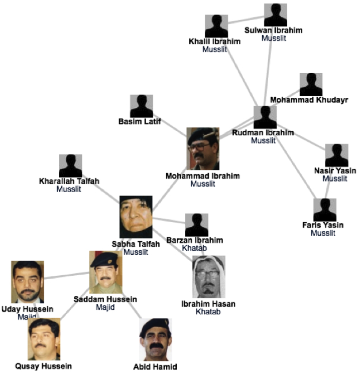

# 第二章 传播网络分析

网络科学

Invasion that started in March 19,  2003. Many of the regime's high ranking officials, including Saddam Hussein, avoided capture.
Hussein was last spotted kissing a baby in Baghdad in April 2003, and then his trace went cold.

designed a deck of cards, each card engraved with the images of the 55 most wanted.

It worked: by May 1, 2003, 15 men on the cards were captured, and by the end of the month another 12 were under custody.
Yet, the ace of spades (see Figure), i.e. Hussein himself, remained at large.

Col James Hickey, in charge of a series of raids known Operation Desert Scorpion, wanted to know the relationship between everyone killed or captured. The task fell to Lt. Col. Steve Russell, who was in direct charge of the raids. Then there was Brian Reed, the operations officer under Col. Hickey, who was exposed to social networks during his studies at West Point.

 Realizing that capturing the faces of the Iraq regime was of little help in cornering Saddam himself, these men started to systematically reconstruct the social network of Saddam's inner circle. They did not rely on government documents and decrees, but rather gossip and family trees.  Instead of focusing on military titles, they learned to understand the five names each Iraqi man had, listing the name of their father, grandfather, and the city of origin-- serving as a family tree.

As they meticulously pieced together an extensive diagram of who drank with whom and who is related to whom in the Tikrit region, where Saddam was from, they started to use network diagrams to guide the raids. In one of those raids they found over \$8 million in US currency, about \$1 million in Iraqi currency, jewelry worth over \$2 million, rifles and ammunition. Yet, the biggest prize was Saddam's family photo album, providing the faces of those that the family trusted, filling with intimate details their growing network diagram.

Their increasingly detailed maps consistently pointed to two individuals, Rudman Ibrahim and Mohammed Ibrahim. They served instead as Saddam's second-level bodyguards, numbering about 40 who ran the daily tasks, serving as his driver, cook, or mechanic.

Yet, Rudman, whom the investigators believed that he knew Hussein's whereabouts, had a heart attack and died within a few hours of his capture.
Next the investigators used their network diagram to identify individuals who could have known the whereabouts of Mohammad, dubbed the "fat man".  Not a major player in the regime's power structure,  while Saddam's whereabouts kept secret, Mohammed's social ties were not as protected as Saddam's.
 once they found someone to turned Mohammed Ibrahim in, the same man escorted them to a farm near the Tigris river, reveling the spider hole that hid the dictator himself.

图论（graph theory）

欧拉
哥尼斯堡七桥问题：一个人怎样才能一次走遍七座桥，每座桥只走过一次，最后回到出发点？

斯坦利·米尔格兰姆(Stanley Milgram)
- 六度分隔
- 小世界现象 “The Small-World Phenomenon”

Watts and Strogatz (1999)以一定概率随机重连规则网络中的连边
- 可以大幅度降低网络的平均路径长度
- 可以有效增加网络的聚类系数

Barabási, Albert （1999）网络度分布具有标度不变特性
- 优先链接机制

The response time
- 间隔时间的幂律分布

成功的秘密
泊松(Simeon-Denis Poisson,1781—1840)
法国数学家。
